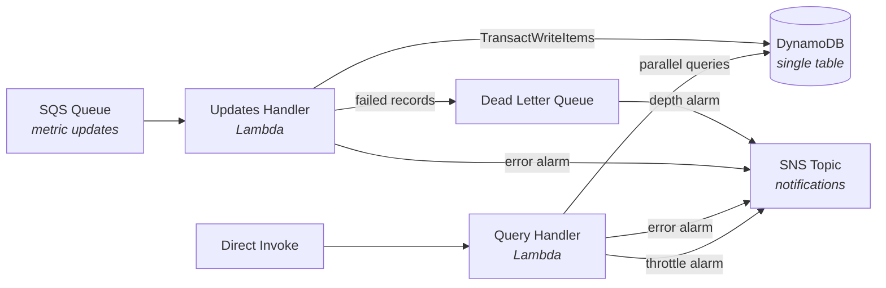

# Feature Usage Lambdas

<div align="center">

<strong>Serverless feature usage tracking with atomic deduplication, smart query optimization, and three-tier error classification.</strong>

<br>
<br>

[](https://github.com/gufranco/mixmax-engineer-assessment/actions/workflows/ci.yml)
[](https://nodejs.org/)
[](https://www.typescriptlang.org/)
[](https://aws.amazon.com/serverless/sam/)

</div>

---

**2** Lambda functions · **114** tests · **95%** coverage threshold · **15** tunable SAM parameters · **4** production dependencies · **3** CloudWatch alarms · **0** mocks

> Technical assessment for the Senior Platform Engineer position at [Mixmax](https://www.mixmax.com).

<table>
<tr>
<td width="50%" valign="top">

### Atomic Deduplication
`TransactWriteItems` with `attribute_not_exists` conditions prevent double-counting on SQS redelivery. Dedup records auto-expire after 24 hours via DynamoDB TTL.

</td>
<td width="50%" valign="top">

### Smart Query Splitting
Date ranges split into optimal segments: daily rollup keys for full days, hourly keys for partial edges. Reduces DynamoDB reads by up to 24x on the full-day portion.

</td>
</tr>
<tr>
<td width="50%" valign="top">

### Three-Tier Error Classification
Every error is classified as permanent, transient, or unclassified before deciding what to do with it. Unclassified defaults to transient for data safety.

</td>
<td width="50%" valign="top">

### Partial Batch Failures
`ReportBatchItemFailures` returns only failed SQS records. Valid records in the same batch succeed, and only broken ones retry or route to the DLQ.

</td>
</tr>
<tr>
<td width="50%" valign="top">

### Zero-Mock Testing
114 test cases against real DynamoDB on LocalStack. No mocks for infrastructure. Pure functions tested in isolation, handlers tested against actual storage.

</td>
<td width="50%" valign="top">

### Production-Grade Observability
Pino structured JSON logs, AWS X-Ray tracing, Lambda Insights, CloudWatch alarms on errors, throttles, and DLQ depth, all wired to an SNS notification topic.

</td>
</tr>
</table>

## Architecture



The **Updates Handler** processes SQS messages containing metric increments and writes both hourly and daily counters to DynamoDB. For each message, it atomically writes workspace-level metrics and optionally user-level metrics alongside a deduplication record.

The **Query Handler** is invoked directly to query usage metrics. It splits date ranges into optimal segments: full days use daily rollup keys, while partial days at the edges use hourly keys. A query from `2024-01-15T05` to `2024-01-20T18` issues 3 parallel queries: hourly keys for the 15th from T05, daily rollups for the 16th through 19th, and hourly keys for the 20th through T18.

### Why standard SQS, not FIFO

Counter increments are commutative: `ADD 5` followed by `ADD 3` produces the same result regardless of order. FIFO's ordering guarantee adds no value. FIFO's deduplication window is only 5 minutes, too short for protection during DLQ replay or operational incidents. Standard SQS has nearly unlimited throughput with no configuration, while FIFO caps at 300 msg/s per message group.

## DynamoDB Schema

Single table design with composite key (`pk`, `sk`). Partition keys use `#` as a structural delimiter, so all identifiers are validated against `/^[a-zA-Z0-9_-]+$/` at the input boundary.

| Entity | pk | sk |
|:-------|:---|:---|
| User hourly metric | `USR#{userId}#MET#{metricId}` | `H#YYYY-MM-DDThh` |
| User daily metric | `USR#{userId}#MET#{metricId}` | `D#YYYY-MM-DD` |
| Workspace hourly metric | `WSP#{workspaceId}#MET#{metricId}` | `H#YYYY-MM-DDThh` |
| Workspace daily metric | `WSP#{workspaceId}#MET#{metricId}` | `D#YYYY-MM-DD` |
| Dedup record | `DEDUP#{messageId}` | `DEDUP#{messageId}` |

Each metric item contains `count` (accumulated value) and `ttl` (epoch seconds, refreshed on every write so active metrics stay alive while stale data expires). Dedup records contain only `ttl` and auto-expire after 24 hours.

## Lambda 1: Query Handler

Directly-invoked Lambda that queries usage metrics. Accepts a metric name, a user or workspace identifier, and a date range (max 1825 days), then returns the total count.

**Input:**

```json
{
  "metricId": "emails-sent",
  "userId": "user-123",
  "workspaceId": "ws-456",
  "fromDate": "2024-01-15T00",
  "toDate": "2024-01-15T23"
}
```

| Field | Required | Format | Notes |
|:------|:--------:|:-------|:------|
| `metricId` | Yes | string | Alphanumeric, hyphens, and underscores. Max 128 characters |
| `workspaceId` | Yes | string | Queries `WSP#` metrics. Same format constraints |
| `userId` | No | string | If provided, queries `USR#` metrics instead of `WSP#` |
| `fromDate` | Yes | `YYYY-MM-DDThh` | Start of date range (hourly precision) |
| `toDate` | Yes | `YYYY-MM-DDThh` | End of date range. Max 1825 days from `fromDate` |

Validation errors return structured responses instead of throwing:

```json
{
  "error": {
    "code": "VALIDATION_ERROR",
    "message": "metricId is required and must be a non-empty string",
    "requestId": "abc-123-def"
  }
}
```

## Lambda 2: Updates Handler

SQS-triggered Lambda that processes usage tracking events. Each message increments both hourly and daily counters for the workspace and optionally for the user.

**Input (SQS message body):**

```json
{
  "workspaceId": "ws-456",
  "userId": "user-123",
  "metricId": "emails-sent",
  "count": 1,
  "date": "2024-01-15T14"
}
```

| Field | Required | Format | Notes |
|:------|:--------:|:-------|:------|
| `schemaVersion` | No | number | Defaults to `1`. Enables safe schema evolution during rolling deployments |
| `workspaceId` | Yes | string | Always writes a `WSP#` entry |
| `userId` | No | string | If provided, also writes a `USR#` entry |
| `metricId` | Yes | string | Alphanumeric, hyphens, and underscores. Max 128 characters |
| `count` | Yes | number | Positive integer, max 1,000,000 |
| `date` | Yes | `YYYY-MM-DDThh` | The hour the usage occurred |

## Design Decisions

<details>
<summary><strong>Idempotent, atomic writes</strong></summary>
<br>

Each SQS message is processed using `TransactWriteItems`. The transaction includes a deduplication record keyed by the SQS `messageId` with an `attribute_not_exists(pk)` condition, alongside the hourly and daily counter updates. If SQS redelivers a message, the condition check fails and the entire transaction is cancelled.

This costs 2x the write capacity compared to individual `UpdateItem` calls. Data integrity matters more than write cost savings, and PAY_PER_REQUEST billing absorbs the overhead without provisioning changes.

</details>

<details>
<summary><strong>Connection management</strong></summary>
<br>

The DynamoDB client uses explicit timeouts via `NodeHttpHandler`: 3 seconds for connection and 5 seconds for request. Without these, a hanging DynamoDB call would consume the full 30-second Lambda timeout, wasting concurrency slots and delaying error detection.

</details>

<details>
<summary><strong>Type safety and validation</strong></summary>
<br>

Zod schemas are the single source of truth for both runtime validation and compile-time types. TypeScript types are derived via `z.infer<typeof schema>`, eliminating drift between what the validator accepts and what the code expects. Zero `any` in production code. Date fields are checked against the calendar (e.g., `2024-02-31` is rejected), and all identifiers are validated against `/^[a-zA-Z0-9_-]+$/` to prevent `#` injection into DynamoDB keys.

</details>

<details>
<summary><strong>Error classification</strong></summary>
<br>

The updates handler classifies every error into one of three tiers:

- **Permanent** (malformed JSON, validation failures, `AccessDeniedException`, `ResourceNotFoundException`): acknowledged and dropped. Retrying would produce the same result.
- **Transient** (DynamoDB throttling, timeouts, service unavailable, transaction conflicts): returned in `batchItemFailures` so SQS retries. After `maxReceiveCount` attempts, moves to the DLQ.
- **Unclassified**: defaults to transient. Safer for data integrity: if genuinely transient, the retry succeeds. If permanent, it exhausts retries and lands in the DLQ for investigation.

Permanent errors from bad input never reach the DLQ. The DLQ contains only repeated transient or unclassified failures, making it a reliable signal for infrastructure issues.

</details>

<details>
<summary><strong>Observability</strong></summary>
<br>

Pino produces structured JSON logs with `service` and `requestId` fields on every line. Error logs preserve full stack traces. AWS X-Ray is active on both handlers. CloudWatch error alarms on both handlers plus a throttle alarm on the query handler are wired to an SNS topic. Lambda Insights provides memory usage, cold start duration, and CPU metrics. Log retention is configurable per environment (default 30 days).

</details>

<details>
<summary><strong>Testing approach</strong></summary>
<br>

Zero mocks. Unit tests validate pure functions: validation, key building, query segmentation, error classification, and config readers. Integration tests run handlers against real DynamoDB on LocalStack, including deduplication verification and mixed-range query optimization. SQS events are constructed in-memory using a `buildSqsEvent` helper. All tests follow Arrange-Act-Assert with explicit comments.

</details>

<details>
<summary><strong>Security</strong></summary>
<br>

All identifiers validate against `/^[a-zA-Z0-9_-]+$/` (max 128 characters) to prevent `#` injection into DynamoDB partition keys. `count` is capped at 1,000,000. IAM follows least privilege: query handler has `dynamodb:Query` only, updates handler has `dynamodb:UpdateItem` and `dynamodb:PutItem` only, both scoped to the specific table ARN. SQS queues use server-side encryption.

</details>

## Quick Start

### Prerequisites

| Tool | Version | Install |
|:-----|:--------|:--------|
| Node.js | >= 22 | [nodejs.org](https://nodejs.org/) or `nvm install 22` |
| pnpm | >= 9 | `corepack enable && corepack prepare pnpm@latest --activate` |
| Docker | >= 20 | [docker.com](https://www.docker.com/) or `brew install colima docker` |
| AWS CLI | >= 2 | [aws.amazon.com/cli](https://aws.amazon.com/cli/) or `brew install awscli` |
| AWS SAM CLI | >= 1.100 | [docs.aws.amazon.com](https://docs.aws.amazon.com/serverless-application-model/latest/developerguide/install-sam-cli.html) or `brew install aws-sam-cli` |

### Setup

```bash
pnpm install
cp .env.example .env
pnpm localstack:up
pnpm test
```

### Verify

```bash
curl http://localhost:4566/_localstack/health
# {"services": {"dynamodb": "running", "sqs": "running", ...}}
```

<details>
<summary><strong>Project structure</strong></summary>

```
src/
  config/           # Environment variable readers with safe defaults
  errors/           # ValidationError class, error formatting utility
  infrastructure/   # DynamoDB client, repository, key builders, TTL, query granularity
  logging/          # Pino structured logger
  schemas/          # Zod schemas, regex patterns, identifier constraints
  types/            # TypeScript interfaces derived from schemas
  validators/       # Validation functions wrapping Zod schemas
  metric-query.handler.ts      # Lambda entry point: queries
  metric-updates.handler.ts    # Lambda entry point: updates
tests/
  unit/             # Pure function tests (validation, keys, config, errors)
  integration/      # Handler tests against real DynamoDB on LocalStack
    helpers/        # Test utilities: SQS event builder, DynamoDB helpers
scripts/
  deploy-local.sh   # Build and deploy full SAM stack to LocalStack
  replay-dlq.sh     # Replay DLQ messages back to the main queue
localstack/
  ready.d/init.sh   # Auto-creates DynamoDB table and SQS queues on startup
```

</details>

Files use a `name.type.ts` naming convention: `partition-key.builder.ts`, `query-request.schema.ts`, `validation.error.ts`. The suffix tells you what a file contains before you open it.

## Development

### Commands

| Command | Description |
|:--------|:------------|
| `pnpm test` | Run unit tests (no external deps) |
| `pnpm test:integration` | Run integration tests (requires LocalStack) |
| `pnpm test:all` | Run all tests |
| `pnpm test:coverage` | Run all tests with coverage report |
| `pnpm lint` | Lint with ESLint |
| `pnpm lint:fix` | Auto-fix lint issues |
| `pnpm typecheck` | Strict TypeScript check (`tsc --noEmit`) |
| `pnpm format` | Format with Prettier |
| `pnpm format:check` | Check formatting |
| `pnpm build` | Build with SAM (esbuild, minified, source maps) |

### LocalStack

| Path | Command | What it does | Best for |
|:-----|:--------|:-------------|:---------|
| Quick start | `pnpm localstack:up` | Creates DynamoDB table and SQS queues via init script | Integration tests, fast iteration |
| Full simulation | `pnpm deploy:local` | Builds and deploys the full SAM stack to LocalStack | End-to-end testing, SQS-triggered Lambda execution |

```bash
pnpm localstack:up        # Start (creates resources automatically)
pnpm localstack:logs      # Tail logs
pnpm localstack:down      # Stop
```

On startup, the init script creates: `feature-usage-local` DynamoDB table (TTL enabled), `feature-usage-updates-local` SQS queue, and `feature-usage-updates-dlq-local` DLQ.

### Full Simulation

After `pnpm deploy:local`, SQS messages trigger the updates handler Lambda inside LocalStack:

```bash
# Send a test message
aws sqs send-message \
  --endpoint-url http://localhost:4566 \
  --queue-url http://sqs.us-east-1.localhost.localstack.cloud:4566/000000000000/feature-usage-updates-local \
  --message-body '{"workspaceId":"ws-456","metricId":"emails-sent","count":1,"date":"2024-01-15T14"}'

# Check DynamoDB
aws dynamodb scan --endpoint-url http://localhost:4566 --table-name feature-usage-local

# Invoke query handler
aws lambda invoke \
  --endpoint-url http://localhost:4566 \
  --function-name feature-usage-local-MetricQueryHandler \
  --payload '{"workspaceId":"ws-456","metricId":"emails-sent","fromDate":"2024-01-01T00","toDate":"2024-12-31T23"}' \
  /dev/stdout
```

## Environment Variables

| Variable | Description | Required | Default |
|:---------|:------------|:--------:|:--------|
| `ENV` | Environment name (`local`, `staging`, `production`) | No | `local` |
| `LOG_LEVEL` | Minimum log level | No | `info` |
| `TTL_DAYS` | Days before DynamoDB items expire | No | `90` |
| `MAX_DATE_RANGE_DAYS` | Maximum date range for metric queries | No | `1825` |
| `AWS_ENDPOINT_URL` | LocalStack endpoint | No | — |
| `AWS_REGION` | AWS region | No | `us-east-1` |
| `AWS_ACCESS_KEY_ID` | AWS credentials | No | — |
| `AWS_SECRET_ACCESS_KEY` | AWS credentials | No | — |

## Infrastructure

The SAM template (`template.yaml`) is fully parameterized with **15** parameters, each with a sensible default. A bare `sam deploy` works out of the box.

```bash
sam deploy --parameter-overrides Env=production TtlDays=180 ReservedConcurrency=50
```

<details>
<summary><strong>All SAM parameters</strong></summary>
<br>

**Application**

| Parameter | Default | Description |
|:----------|:--------|:------------|
| `Env` | `local` | Environment name. Controls table and queue names |
| `TtlDays` | `90` | Days before DynamoDB items expire via TTL |
| `MaxDateRangeDays` | `1825` | Maximum date range for metric queries |

**Lambda**

| Parameter | Default | Description |
|:----------|:--------|:------------|
| `LambdaTimeout` | `30` | Function timeout in seconds |
| `LambdaMemorySize` | `256` | Function memory in MB |
| `ReservedConcurrency` | `10` | Max concurrent executions for updates handler |
| `QueryReservedConcurrency` | `10` | Max concurrent executions for query handler |
| `LogLevel` | `info` | Minimum log level |
| `LogRetentionDays` | `30` | CloudWatch log group retention in days |

**SQS**

| Parameter | Default | Description |
|:----------|:--------|:------------|
| `SqsBatchSize` | `10` | Messages per Lambda invocation |
| `SqsVisibilityTimeout` | `60` | Visibility timeout in seconds |
| `MaxReceiveCount` | `3` | Delivery attempts before routing to DLQ |
| `DlqRetentionPeriod` | `1209600` | DLQ message retention in seconds (14 days) |

**Alarms**

| Parameter | Default | Description |
|:----------|:--------|:------------|
| `ErrorAlarmThreshold` | `5` | Error count that triggers handler error alarms |
| `ErrorAlarmPeriod` | `60` | Evaluation period in seconds |
| `ErrorAlarmEvaluationPeriods` | `3` | Consecutive periods before alarm fires |

</details>

### Resources

- **DynamoDB table**: PAY_PER_REQUEST billing, TTL, Point-in-Time Recovery, `DeletionPolicy: Retain`
- **SQS queue**: DLQ via RedrivePolicy, server-side encryption
- **Dead letter queue**: 14-day retention, server-side encryption
- **CloudWatch alarms**: DLQ depth, updates handler errors, query handler errors, query handler throttles
- **SNS topic**: Subscribe email, Slack webhook, or PagerDuty for alarm notifications
- **X-Ray tracing**: Active on both handlers
- **Lambda Insights**: Memory, cold starts, and CPU metrics via managed extension
- **CloudWatch log groups**: Configurable retention (default 30 days)
- **IAM least-privilege**: Query handler gets `dynamodb:Query`. Updates handler gets `dynamodb:UpdateItem` and `dynamodb:PutItem`. Both scoped to the specific table ARN

## Error Handling

The updates handler uses partial batch failure reporting with error classification:

1. Each record is processed independently with its own try/catch
2. Valid records succeed even if others in the batch fail
3. Errors are classified as transient or permanent using the error name and HTTP status code
4. Permanent errors are acknowledged and dropped immediately
5. Transient errors are returned in `batchItemFailures` for SQS retry
6. After `maxReceiveCount` retries, messages move to the DLQ
7. DLQ depth alarm fires when any message arrives

The query handler returns structured error responses for invalid input. System errors throw and are reported as Lambda invocation failures.

### Replaying DLQ Messages

```bash
./scripts/replay-dlq.sh

# For non-local environments:
QUEUE_URL=https://sqs.us-east-1.amazonaws.com/123456789/feature-usage-updates-production \
DLQ_URL=https://sqs.us-east-1.amazonaws.com/123456789/feature-usage-updates-dlq-production \
./scripts/replay-dlq.sh
```

<details>
<summary><strong>Operational runbook</strong></summary>
<br>

#### DLQ Alert: Messages in Dead Letter Queue

`DLQDepthAlarm` fires when `ApproximateNumberOfMessagesVisible > 0`. Permanent errors never reach the DLQ, so messages here represent repeated transient failures.

**1. Assess:**

```bash
aws sqs get-queue-attributes \
  --queue-url <DLQ_URL> \
  --attribute-names ApproximateNumberOfMessagesVisible ApproximateNumberOfMessagesNotVisible
```

**2. Sample messages:**

```bash
aws sqs receive-message \
  --queue-url <DLQ_URL> \
  --max-number-of-messages 5 \
  --visibility-timeout 30
```

**3. Check Lambda logs:**

```bash
aws logs filter-log-events \
  --log-group-name /aws/lambda/<FUNCTION_NAME> \
  --filter-pattern '"transient error" OR "permanent error"' \
  --start-time <EPOCH_MS> --end-time <EPOCH_MS>
```

**4. Determine root cause:**

| Error message | Root cause | Action |
|:--------------|:-----------|:-------|
| `ProvisionedThroughputExceededException` | DynamoDB throttling | Switch to on-demand or increase capacity |
| `ServiceUnavailable` / timeout | Transient AWS issue | Replay messages |
| `ConditionalCheckFailedException` | DynamoDB condition failed | Investigate item state |

**5. Replay or discard:**

```bash
# Replay after fixing root cause
QUEUE_URL=<MAIN_QUEUE_URL> DLQ_URL=<DLQ_URL> ./scripts/replay-dlq.sh

# Purge if permanently invalid (document the data loss)
aws sqs purge-queue --queue-url <DLQ_URL>
```

**6. Verify:** Confirm DLQ is empty. Alarm returns to OK within 5 minutes.

#### Lambda Error Alarm

**1. Check recent errors:**

```bash
aws logs filter-log-events \
  --log-group-name /aws/lambda/<FUNCTION_NAME> \
  --filter-pattern '"query failed" OR "transient error" OR "permanent error" OR "batch partially failed"' \
  --start-time <EPOCH_MS>
```

**2. Check throttling:**

```bash
aws cloudwatch get-metric-statistics \
  --namespace AWS/Lambda --metric-name Throttles \
  --dimensions Name=FunctionName,Value=<FUNCTION_NAME> \
  --start-time <ISO_TIME> --end-time <ISO_TIME> \
  --period 60 --statistics Sum
```

If throttling is high, increase `ReservedConcurrentExecutions`.

</details>

## CI/CD

GitHub Actions runs on every push and PR to `main`:

| Job | What it checks |
|:----|:---------------|
| `lint-and-typecheck` | ESLint + strict `tsc --noEmit` |
| `unit-tests` | Pure function tests with coverage |
| `integration-tests` | Handler tests against real DynamoDB on LocalStack (service container) |

Locally, Husky pre-commit hooks run lint-staged (ESLint + Prettier) and `pnpm typecheck`. Pre-push hooks run the full suite: lint, format check, typecheck, and all tests.

## Building and Deploying

```bash
# Build (esbuild, minified with source maps)
pnpm build

# Deploy (requires AWS credentials)
sam deploy --guided --parameter-overrides Env=production
```
